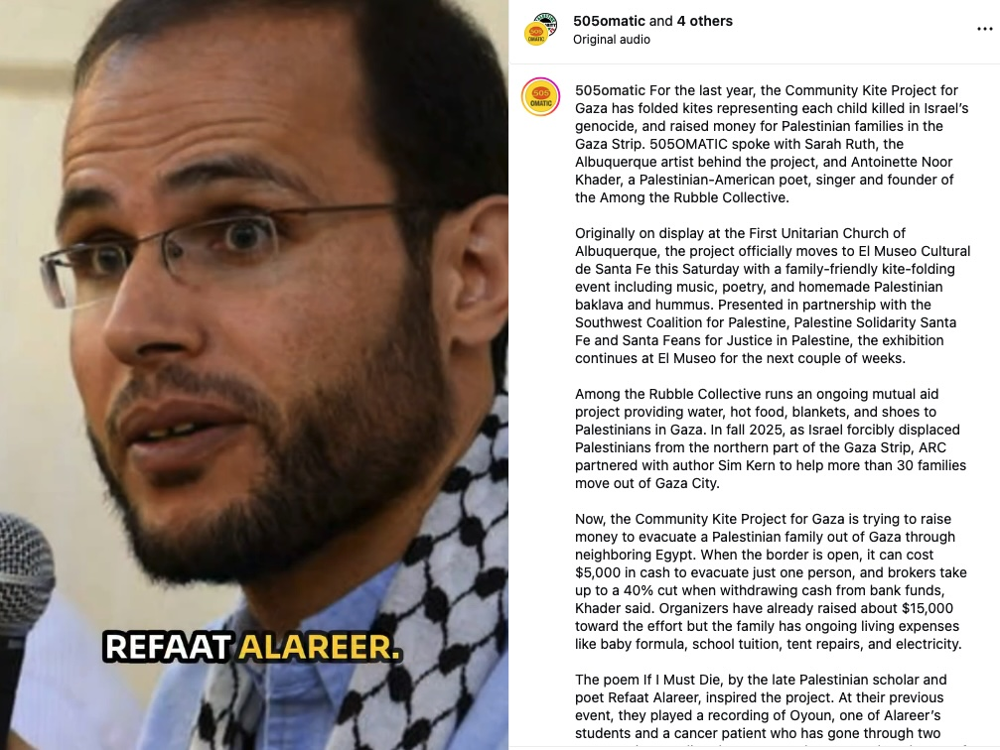
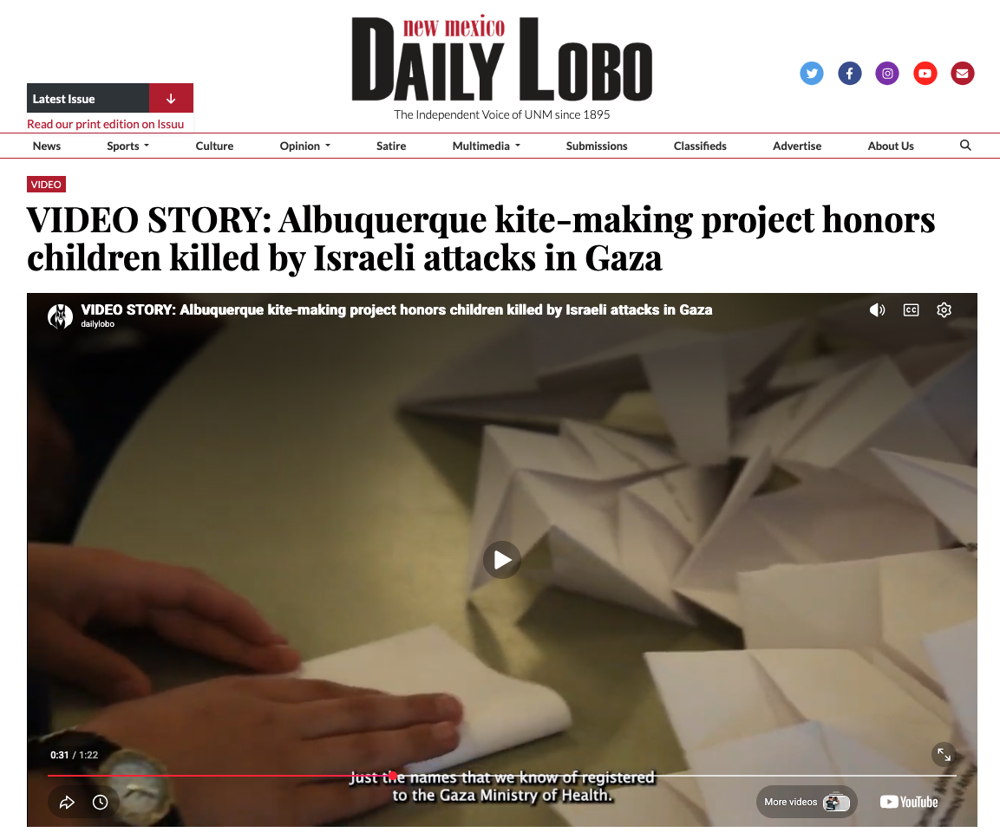

<h5>by Noor</h5>

We are VERY FAR from our goal of evacuating Mohammed's family out of Gaza. I would like to re-explain the process of exiting Gaza through Egypt and why so much funding is needed to evacuate a family. All families must register through Ya Hala, a "travel agency" in Egypt extorting Gazans trying to escape Gaza through the Rafah Border. Ya Hala's owner is tied to the Egyptian government and was at one point making $2 million a day from extorting Gazans fleeing the genocide (<a href='https://www.business-humanrights.org/en/latest-news/egypt-tourism-firm-is-allegedly-making-millions-exploiting-palestinians-fleeing-israels-war-on-gaza' target='_blank'>Egypt: 'Tourism' firm is reportedly making millions exploiting Palestinians fleeing Israel's war on Gaza - Business and Human Rights Centre</a>).

It was announced that each family member will cost $5,000 (which is different than in 2024, children used to be $2,500). Rafah is currently open on a trial basis. The goal is to get as many sick and injured people out of the Gaza Strip first, then general registration will open. Once registration is open, families must give all the money for each family member to Ya Hala IN CASH. Here's where it gets even more difficult. To take fundraiser funds that are transferred to a family's bank account and liquidate them to cash, families must exchange their funds to greedy brokers on the ground in Gaza who charge up to 50% commission. <strong>That means that half of what we raise goes directly to commission</strong>. Families also initially lose up to 20% to bank fees and international transfer fees when we transfer the funds through several channels just to get them to their bank account.

<h2>Here is where it gets even more difficult</h2>

We started this new goal of evacuating Mohammed's family after we evacuated 30 families from North to South Gaza in the fall/winter of 2025, at the point we had hit $84,625 through the assistance of our amazing promoter, New York Times Bestseller Sim Kern. Chuffed then promoted our campaign during Ramadan 2026, gaining around $15,000! Alhamdulillah! The remainder of the donations have been completely organic, through fighting social media suppression and individually reaching out to folks via social media as well as partnering with local Albuquerque art project The Community Kite Project for Gaza, inspired by the late scholar Refaat Al Areer's poem "If I Must Die" where he describes his own death being represented by a white kite with a tail and child looking up at it as if it were an angel. We are creating over 20,000 small paper origami kites with children's names and ages on them who were killed in the genocide from 2023 to 2025. Here is some press coverage of the project:

{:target="_blank"}

{:target="_blank"}

We continue to have events to raise awareness of the genocide in Gaza and to raise money for Mohammed's family and other families in the Among the Rubble Collective network.

<h2>The Breakdown of Funds Needed</h2>

Because we only started this fundraiser specifically for Mohammed's family at $84,625 and the total is now $106,867, Mohammed's family has now received $22,242. They lost around 15% to bank fees and international transfer fees which amounts to $18,905.70. Mohammed's family consists of 10 people, 3 of which are young children and a newborn. Mohammed's family is faced with the challenge of simultaneously saving up for evacuation and living from day to day with extortionate prices for everyday necessities such as food, water, diapers, baby formula, tent repairs, clothes for each season and losing up to 50% to liquidate their bank funds into cash to buy goods. With these fees, they have been spending $2,500 per month just to live. That means $18,905 has dwindled over the past few months. Recently, Mohammed's family made the difficult decision to buy a battery to charge their phones, as they were walking each day to another family's tent and paying a fee each day just to charge their phones. They tried to buy a used battery for around $1,000, but upon testing it, it did not hold a charge, so they were forced to buy a new battery for $3,500. Their funds are slowly diminishing, not leaving them much to save up for evacuation.

To evacuate Mohammed's family of 12 at $5,000 per person, they need $60,000, but that's not including the 50% broker fee and 15% bank fees. We need to double that to a goal of $120,000, then add 15% to cover the bank fees (around $18,000). The total to evacuate will be at least $138,000. That's not even including the $2,500 a month to cover living expenses.

<h2>Here's how to help</h2>

<strong><a href='https://chuffed.org/project/gaza-city-evacuation' target=_blank>Donate!</a></strong> Chuffed offers recurring donations of every week or month. Even a small recurring donation is a form of security for Mohammed's family.

<strong><a href='https://chuffed.org/project/gaza-city-evacuation' target=_blank>Share the donation link!</a></strong> You can share the link with friends, family members, coworkers, private messaging groups, Palestine action groups and businesses via text message, e-mail, and private messages on social media. You can also make a post about the campaign on social media and share it in your "stories" with the link to donate. We need an army of Among the Rubble supporters to make the link go viral as we are heavily suppressed on social media due to content about Palestine.

<strong>Print flyers!</strong> I have a ready to print flyer that you can approach businesses with, hang on community bulletin boards, or hang in public spaces. Please connect with me at <a href="mailto:noorsafiyafalastini@gmail.com">noorsafiyafalastini@gmail.com</a> and on Instagram by following <a href='https://www.instagram.com/amongtherubblecollective' target=_blank>Among the Rubble Collective</a>

<em>Thanks for your support!</em>
