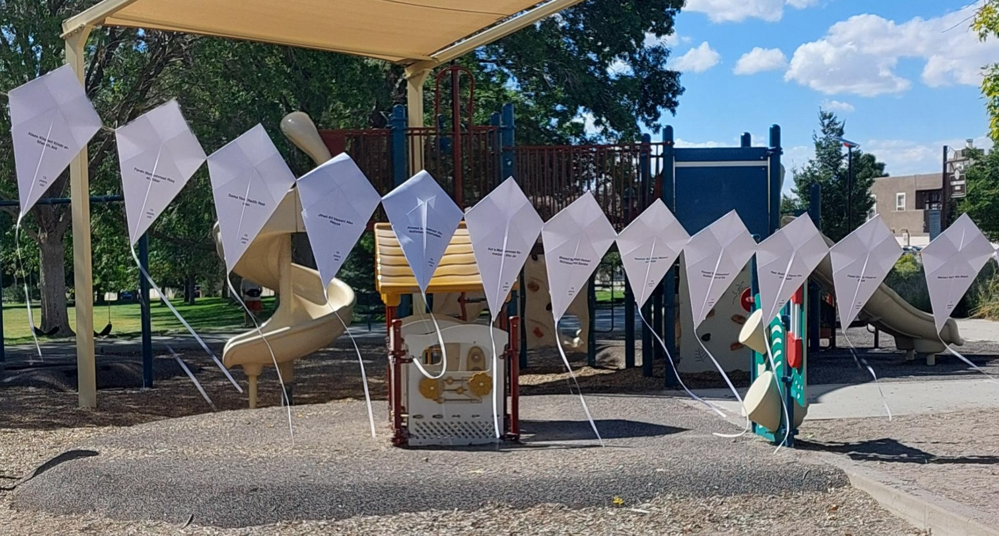

The Community Kite Project for Gaza, a large-scale art public project in so-called Albuquerque, NM, invites community members in the creation of over 21,000 small origami kites. Each kite bears the name and age of a child killed in Gaza from Oct 7, 2023-Sep 18, 2025. Grievously, this is not the  total number of children martyred by Israel's US-backed ongoing genocide against the Palestinians. CKPG continues to bring awareness to the magnitude of this atrocity, and moreover, remembers and honors each child. 

On Aug 23, 2026, the ‘Israeli’ Ministry of ‘Defense’ said that “We will treat the kites that children play with in Gaza as an act of war.” The <a href='https://www.middleeastmonitor.com/20260825-un-decries-outrageous-israeli-threat-to-expel-gazans-over-kite-flying'>UN Human Rights Office called this announcement 'outrageous'</a>. Two children have been killed for flying kites since this statement. 

CKPG was inspired by renowned Palestinian poet and literature professor Refaat Alareer's poem "[If I Must Die](_posts/2025-10-31-if-i-must-die.markdown)". Professor Alareer was tragically killed during the genocide along with several of his family members. 

CKPG raises funds for families via the [Among the Rubble Collective](https://www.instagram.com/amongtherubblecollective). ARC is a grassroots fundraising collective led by a Palestinian-American and organized by volunteers in America, Canada, Jordan and Gaza. They raise money for families in dire need and support Palestinians in Gaza providing mutual aid, education, and evacuation support. 

Currently, the kite project has folded over 2,500 kites completed by hundreds of community members, and local organizations. Every person who has participated in the project has been deeply moved by the process and intent of the project. We have engaged participants at public events across the city and have experienced overwhelming support. 

Because many of Gaza's institutions have been destroyed during the genocide, the kite project is looking for public institutions to display the kites. Eventually, images of the displayed kites across Albuquerque will be shown together with the kites in an exhibit yet to be determined.

Community members are welcome to help fold the kites for display. Any <a href='https://chuffed.org/project/gaza-city-evacuation'>donation to ARC</a> helps them support the living while we honor the dead.

As we collectively continue to witness, and learn more, about the depth of Israel's war crimes, the Community Kite Project for Gaza intends to form a path towards healing and grieving together in order to continue the fight for Palestinian liberation.

Contact [info@abqkitesforgaza.art](mailto:info@abqkitesforgaza.art) for more information or to invite the project to your next event.
