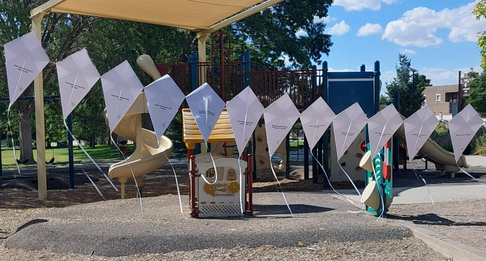

The Community Kite Project for Gaza, a large-scale public art project in so-called Albuquerque, NM, invites community members in the creation of 21,907 small origami kites. Each kite honors a child killed in Gaza during the first 23 months of the genocide and bears their name and age. Grievously, this is not the total number of children martyred by Israel’s US-backed ongoing genocide against the Palestinians. 

On Aug 23, 2026, the ‘Israeli’ Ministry of ‘Defense’ said that “We will treat the kites that children play with in Gaza as an act of war.” The <a href='https://www.middleeastmonitor.com/20260825-un-decries-outrageous-israeli-threat-to-expel-gazans-over-kite-flying'>UN Human Rights Office called this announcement 'outrageous'</a>. Two children have been killed for flying kites since this statement. 

CKPG was inspired by renowned Palestinian poet and literature professor Refaat Alareer's poem "[If I Must Die](_posts/2025-10-31-if-i-must-die.markdown)". Professor Alareer was tragically killed during the genocide along with several of his family members. 

CKPG raises funds for families via the [Among the Rubble Collective](https://www.instagram.com/amongtherubblecollective). ARC is a grassroots fundraising collective led by a Palestinian-American and organized by volunteers in America, Canada, Jordan and Gaza. They raise money for families in dire need and support Palestinians in Gaza providing mutual aid, education, and evacuation support. Together we honor the innocents by <a href='/among-the-rubble'>continuing to support those still alive and struggling to survive</a>. 

Currently, CKPG has engaged community members and local organizations in Albuquerque and Santa Fe resulting in hundreds of people folding over 3,000 kites. CKPG has been featured in the <a href='/news'>Santa Fe New Mexican, 505omatic, and the New Mexico Daily Lobo</a>. 

The genocide has completely decimated Gaza’s infrastructure. Therefore, CKPG engages public institutions to display the kites. The kites have been displayed at the First Unitarian Church in Albuquerque, El Museo Cultural de Santa Fe, and we are now honored to be a part of the Día de los Muertos exhibit at the Guiterrez-Hubble House. 

Visit the <a href='/events'>events page</a> for a listing of upcoming kite folding events. You can also contact [info@abqkitesforgaza.art](mailto:info@abqkitesforgaza.art) to schedule an event for your organization, school, faith-based institution, or for your friends and family members. We ask for a pledge of any amount to Among the Rubble Collective for each kite created. You can donate by visiting https://abqkitesforgaza.art/among-the-rubble. If you are unable to donate, we ask that you share the link.

As we collectively continue to witness and learn more about the depth of Israel’s war crimes, the Community Kite Project for Gaza intends to create space to grieve together, honor each child, and continue the fight for Palestinian liberation.
